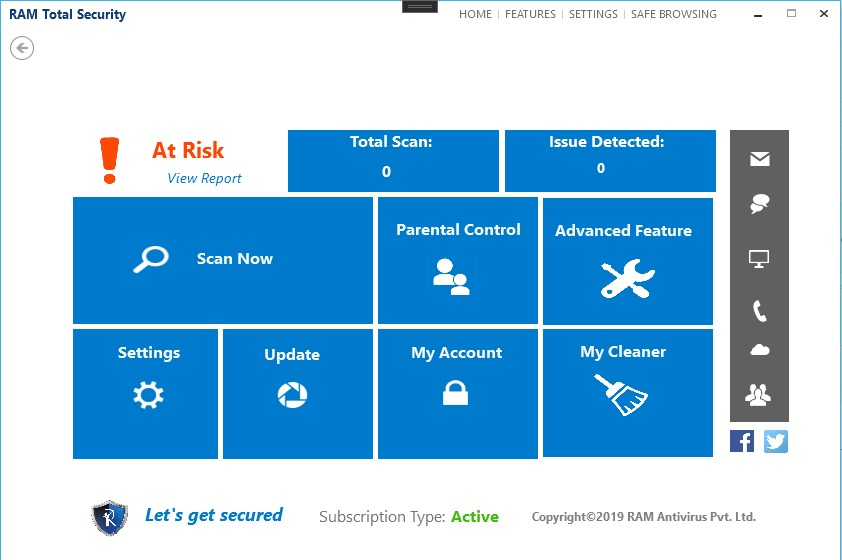

# Ram_AntiVirus
Defend your PC against viruses and malware with the best antivirus software, offering real-time protection and frequent updates.

### What RAM Antivirus brings to you

RAM Antivirus is loaded with useful, functional options that allow users to quickly and easily Virus removal. But that’s not all, when you buy RAM Ultimate Antivirus you will also get the most amazing PRO Features!

1. Stop PC control takers: Protect your computer against threats: spyware, adware, Trojan horses, ransomware, PUP, hijackers, etc.

2. Robust and Real-time scanning: Get the most up-to-date protection with database updates 2 to 4 times a day, as well as in-depth System scan also analysis and removal tools.

3. Easy to use and affordable: Install our RAM Antivirus and get the Parental controls lightweight program that will not slow down your PC and will not work with your antivirus.

[Dawanlode](https://ramantivirus.com/ram-ultimate-antivirus/)
